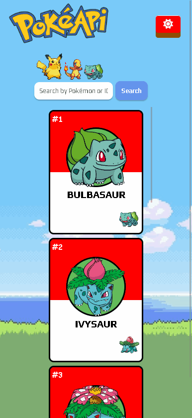

# Projeto Pokédex com PokéAPI

Esta é uma aplicação web que permite pesquisar Pokémons pelo nome ou ID. Ela oferece uma interface limpa e responsiva onde você pode explorar o vasto mundo dos Pokémons.

## Visão Geral

Neste projeto, foi usado uma API chamada PokéAPI em conjunto com o React.js, que permite pesquisar Pokémons pelo nome ou ID.

### Resultado

[Clique aqui para acessar a página da aplicação](https://pokedex-api-com-react-6cutj5uet-guilherme-dangelo.vercel.app)

### Design Responsivo

A aplicação também foi feita para ser funcionar e ser responsiva em diversas resoluções, a aplicação também funciona para celulares

[Clique aqui para acessar a página da aplicação](https://pokedex-api-com-react-6cutj5uet-guilherme-dangelo.vercel.app)

## Meu processo

### Feito com:

- React.js
- PokéAPI: https://pokeapi.co/
- JavaScript como linguagem principal
- JEST para fazer testes
- Styled-components: essa biblioteca foi escolhida para a estilização dos componentes.
- React Router DOM: foi utilizado para a navegação entre as páginas da aplicação.
- HTML Semântico

## Funcionalidades do Projeto

* <b>Pesquisa de Pokémons</b>: Busque facilmente Pokémons digitando o nome ou ID na caixa de pesquisa.

* <b>Informações Detalhadas</b>: Obtenha informações detalhadas sobre cada Pokémon, incluindo seu tipo, habilidades e golpes.

* <b>Design Responsivo</b>: A aplicação é projetada para ser responsiva, garantindo uma experiência perfeita em diferentes dispositivos e tamanhos de tela.

* <b>Experiência Interativa</b>: Desfrute de uma interface visualmente atraente e interativa que aprimora sua exploração do mundo Pokémon.

### O que eu aprendi

Eu Tive algumas dificuldades para utilizar os estados com a API, mas aos poucos fui entendendo melhor e dando certo, também melhorei ainda mais meu conhecimento sobre React e suas funcionalidades.

## Como rodar a aplicação em seu computador 💻

- Em uma pasta da sua escolha abra o terminal e digite
> git clone https://github.com/Guilherme-DAngelo/pokedex-api-com-react.git
- para instalar todos arquivos necessários digite
>npm install
- depois para visualizar o projeto digite
>npm start

 

## Autor

- Github - [Guilherme D'Angelo](https://github.com/Guilherme-DAngelo)
- Linkedin - [Guilherme D'Angelo](https://www.linkedin.com/in/guilherme-d-655705218/)
